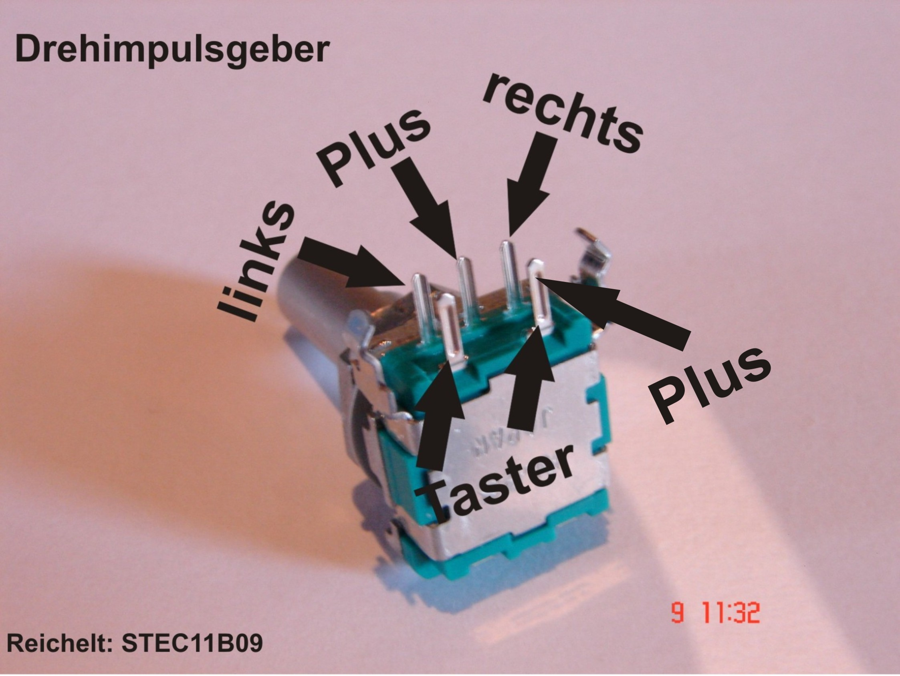

# Schalterbox
The Schalterbox is a hobby project of [@sippndipp](https://twitter.com/sippndipp) and [@rudelm](https://twitter.com/rudelm). Our kids love to push buttons so we decided to make something blinky for them.

## Libraries
* https://github.com/brianlow/Rotary
* https://github.com/FastLED/FastLED
* https://github.com/thomasfredericks/Bounce2

### Run the thing

Alt + CMD + R (verify)
Alt + CMD + U (upload)

## Wiring
```
When connecting a sensor to a pin configured with INPUT_PULLUP, the other end should be connected to ground. In the case of a simple switch, this causes the pin to read HIGH when the switch is open, and LOW when the switch is pressed.
```
Taken from https://www.arduino.cc/en/Tutorial/DigitalPins

So every switch is connected on one pin to the Arduino and the other is connected to ground. Which means we need to check if the pin value is low and need to react to the push or change.

```
pinMode(pin, INPUT_PULLUP);     // Enable pin as input and activate internal pullup resistor
```

The Rotary Encoder also requires in its `begin()` method a boolean set to true, so that the [INPUT_PULLUP is used](https://github.com/brianlow/Rotary/blob/master/Rotary.cpp#L81).

### Rotary Encoder
* push button pin to Arduino pin 2
* encoder pin A to Arduino pin 3
* encoder pin B to Arduino pin 4
* both encoder ground pins to ground (GND)

### Piezo buzzer
* piezo buzzer pin to Arduino pin 5
* other piezo buzzer pin to ground

### WS2801 LED strips
Our LED strips don't use the default color scheme for the wiring, so this is specifically for our used scheme. However, you should be able to find which line is data and clock for your LED strip. [Here's an example from Adafruit for WS2801 LED strips](https://learn.adafruit.com/12mm-led-pixels/wiring).

* power (red) to power (5V)
* ground (yellow) to ground (GND)
* data (green) to Arduino pin 11
* clock (blue) to Arduino pin 12

### Push button for colors
We've got three push buttons for the color selection: red, green, blue
* red to Arduino pin 22
* green to Arduino pin 24
* blue to Arduino pin 26
* other pins of the buttons to ground (GND)

### Push button for sound
We've got a push button with light support which also sticks in its pushed state. It just connects/disconnects the line to the piezo buzzer on Arduino pin 5.

### Switch for changing light direction
We've got a on/on switch which controls the light direction, if there's currently a LED light running in a given direction.
* center pin to ground (GND)
* upper pin to Arduino pin 28
* lower pin to Arduino pin 30


### Rotary switch
The rotary switch controls the currently playing LED mode. Depending on the number of programs we can hook up 6 digital inputs of the arduino
* center pin to ground (GND)
* position 1 pin to Arduino pin 32
* position 2 pin to Arduino pin 34
* position 3 pin to Arduino pin 36
* position 4 pin to Arduino pin 38
* position 5 pin to Arduino pin 40
* position 6 pin to Arduino pin 42

### Power switch (aka. the red switch)
The large power switch connects the 5V power to the board.

## Examples
The examples folder contains example code to deal with certain aspects of our box:

### Debounce
Debouncing a push button to get a reliable button state.

* Pin 5

Obsolete since we use the [Bounce2 library](https://github.com/thomasfredericks/Bounce2).

### ColorTemperature
Example of the FastLED library to control the WS2801 LED stripes.

* data pin on Arduino pin 12
* clock pin on Arduino pin 13

### toneMelody
Example of the Arduino `tone()` method and how to play melodies on a piezo buzzer. https://www.arduino.cc/en/Tutorial/ToneMelody?from=Tutorial.Tone

* Pin 5

### Rotary Encoder
We use a rotary encoder from ALPS, bought from [Reichelt Elektronik](https://www.reichelt.de/drehimpulsegeber-15-impulse-30-rastungen-horizontal-stec11b01-p73911.html?). There's unfortunately no data sheet available. However, we've seen a suitable pin layout on the [mikrocontroller.net forum](https://www.mikrocontroller.net/topic/180758).



According to Reichelt, our rotary encoder has
* 15 pulses
* 30 lock-in positions
* one push button

Two pins are required for rotation detection
One pin is required for push button

The circuit:
* push button pin to Arduino pin 2
* encoder pin A to Arduino pin 3
* encoder pin B to Arduino pin 4
* encoder ground pin to ground (GND)

We've tried to use Interrupts on our Arduino Mega, but weren't successful. The example [interrupt](examples/RotaryEncoder/interrupt/interrupt.ino) doesn't work, the [Polling](examples/RotaryEncoder/Polling/Polling.ino) example works.

### Troubleshooting

https://github.com/adrianmihalko/ch340g-ch34g-ch34x-mac-os-x-driver

